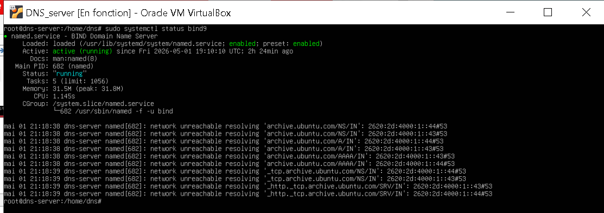
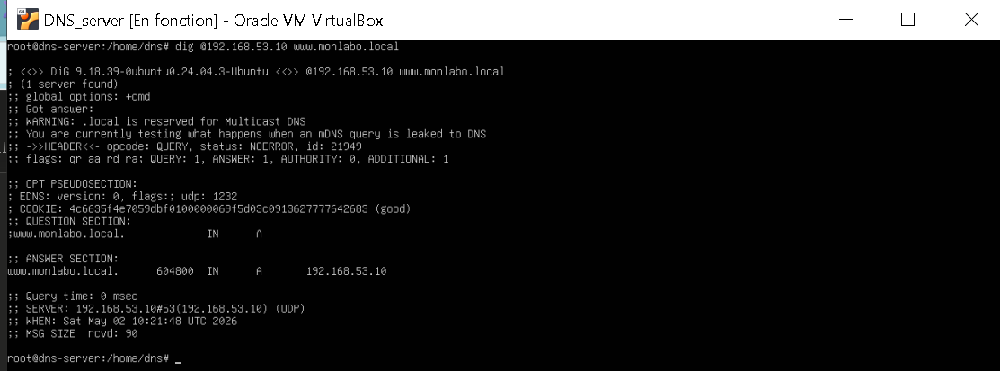
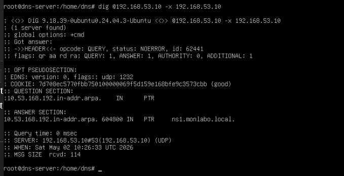

🌐 DNS Server Lab — BIND9

Déploiement d'un serveur DNS complet avec BIND9 sur Ubuntu Server.
Configuration des zones directe et inverse, enregistrements A, MX et NS,
et tests de résolution via dig. Ce serveur DNS constitue la base de
l'infrastructure mail Zimbra (monlabo.local).

🏗️ Architecture du lab

| Machine | Rôle | Adresse IP |
|---|---|---|
| Serveur DNS | BIND9 — monlabo.local | 192.168.53.10 |
| Serveur Mail | mail.monlabo.local | 192.168.53.30 |
| Machine cliente | Tests de résolution DNS | 192.168.53.x |

⚙️ Stack technique

- **BIND9** — Serveur DNS open source
- **Ubuntu Server 22.04** — Système hôte
- **dnsutils** — Outils de diagnostic DNS (dig, nslookup)
- **Domaine local** : monlabo.local

🚀 Étapes de déploiement

1. Installation de BIND9

bash
sudo apt install -y bind9 bind9utils bind9-doc dnsutils

2. Configuration des options globales

Fichier `named.conf.options` — comportement global et sécurité :

3. Déclaration des zones

Fichier `named.conf.local` — déclaration des zones directe et inverse :

4. Fichier de zone directe

Résolution nom → IP (db.monlabo.local) :

5. Fichier de zone inverse

Résolution IP → nom (db.192.168.53) :

6. Démarrage et statut BIND9

bash
sudo systemctl enable bind9
sudo systemctl start bind9
sudo systemctl status bind9

🧪 Tests de résolution DNS

Résolution directe — nom → IP

bash
dig @192.168.53.10 www.monlabo.local

Résolution inverse — IP → nom

bash
dig @192.168.53.10 -x 192.168.53.10

Test enregistrement MX

bash
dig @192.168.53.10 MX monlabo.local

Test enregistrement NS

bash
dig @192.168.53.10 NS monlabo.local

📊 Résultats obtenus

- ✅ BIND9 installé et opérationnel sur port 53
- ✅ Zone directe configurée — résolution nom → IP
- ✅ Zone inverse configurée — résolution IP → nom
- ✅ Enregistrement MX pointant vers mail.monlabo.local
- ✅ Enregistrement NS correctement déclaré
- ✅ Tests dig concluants sur tous les enregistrements
- ✅ Intégration avec le serveur mail Zimbra

🧠 Ce que j'ai appris

- Structure et syntaxe des fichiers de zone BIND9
- Différence entre zone directe et zone inverse
- Rôle des enregistrements MX, NS, A et PTR
- Commande dig pour diagnostiquer la résolution DNS
- Importance du DNS pour l'infrastructure mail

🔗 Projet lié

Ce serveur DNS est la base du projet :
👉 [Zimbra Mail Server Lab](https://github.com/nkombou/zimbra-mail-server-lab)

👤 Auteur

**Franck Nkombou**
Étudiant RSI3 — École Supérieure Technique La Salle, Douala

